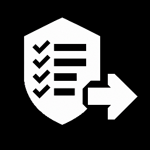
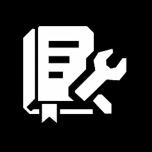

# Skills

*Each skill is ranked from most to least powerful inside its category.*

## Codex Specific

#### Plan My Grill

!! WARNING: This is a good skill !!
Interrogate plans and designs until they are handoff-ready.


```sh
npx skills@latest add CratesSo/skills/plan-my-grill
```

#### Goal

Design durable Codex self-goals with explicit success and stop conditions.


```sh
npx skills@latest add CratesSo/skills/goal
```

#### Actions

Manage workspace actions in `.codex/environments/environment.toml`.


```sh
npx skills@latest add CratesSo/skills/actions
```

## Code Review

#### Slop Team Six

Run evidence-backed cleanup sweeps using subagents and lane playbooks.


```sh
npx skills@latest add CratesSo/skills/slop-team-six
```

#### Audit Team

Coordinate agentic audit workflows from scope mapping through triage and fixes.


```sh
npx skills@latest add CratesSo/skills/audit-team
```

#### Fix

Investigate technical failures before applying narrow, verified fixes.


```sh
npx skills@latest add CratesSo/skills/fix
```

#### Preflight

Run production-readiness preflight checks across security, database, deployment, code, and Bandit scanning for Python.



```sh
npx skills@latest add CratesSo/skills/preflight
```

## Quality of Life

#### Agents Doctor

Audit repo AGENTS.md files for safe cleanup opportunities.


```sh
npx skills@latest add CratesSo/skills/agents-doctor
```

#### Agents Splitter

Split large AGENTS.md guidance into on-demand reference files.


```sh
npx skills@latest add CratesSo/skills/agents-splitter
```

#### Lessons Doctor

Move durable repo lessons into local AGENTS.md guidance.



```sh
npx skills@latest add CratesSo/skills/lessons-doctor
```

#### Handoff

Generate concise continuation prompts from current thread context and tool results.


```sh
npx skills@latest add CratesSo/skills/handoff
```

#### Report

Generate complete standalone HTML reports from recap or custom requests.


```sh
npx skills@latest add CratesSo/skills/report
```

#### Todo

Manage a repo-root `todo.md` with durable four-character item references.


```sh
npx skills@latest add CratesSo/skills/todo
```

## Versions

| Skill | Directory | Current version | Tag |
| --- | --- | --- | --- |
| **actions** | `actions/` | v1.0.7 | `actions/v1.0.7` |
| **agents-doctor** | `agents-doctor/` | v1.0.6 | `agents-doctor/v1.0.6` |
| **agents-splitter** | `agents-splitter/` | v1.0.3 | `agents-splitter/v1.0.3` |
| **audit-team** | `audit-team/` | v1.5.3 | `audit-team/v1.5.3` |
| **fix** | `fix/` | v1.0.1 | `fix/v1.0.1` |
| **goal** | `goal/` | v1.0.1 | `goal/v1.0.1` |
| **handoff** | `handoff/` | v2.0.0 | `handoff/v2.0.0` |
| **lessons-doctor** | `lessons-doctor/` | v1.0.4 | `lessons-doctor/v1.0.4` |
| **plan-my-grill** | `plan-my-grill/` | v1.6.3 | `plan-my-grill/v1.6.3` |
| **preflight** | `preflight/` | v1.0.4 | `preflight/v1.0.4` |
| **report** | `report/` | v1.1.1 | `report/v1.1.1` |
| **slop-team-six** | `slop-team-six/` | v2.0.5 | `slop-team-six/v2.0.5` |
| **todo** | `todo/` | v0.1.2 | `todo/v0.1.2` |

## Install / Pin

Install a skill from this repo with `npx skills@latest add`.

Examples:

- `npx skills@latest add CratesSo/skills/actions`
- `npx skills@latest add CratesSo/skills/plan-my-grill`

Use the matching tag when pinning a published version.

Examples:

- `CratesSo/skills@actions/v1.0.5`
- `CratesSo/skills@plan-my-grill/v1.6.0`
