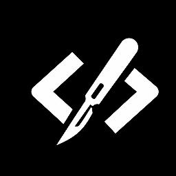

# Skills

*Each skill is ranked from most to least powerful inside its category.*

## Codex Specific

#### Plan My Grill

|  | !! WARNING: This is a good skill !! Interrogate plans and designs until they are handoff-ready. |
| --- | --- |
| Install | `npx skills@latest add CratesSo/skills/plan-my-grill` |

---

#### Goal

|  | Design durable Codex self-goals with explicit success and stop conditions. |
| --- | --- |
| Install | `npx skills@latest add CratesSo/skills/goal` |

---

#### Handoff

|  | Generate concise continuation prompts from current thread context and tool results. |
| --- | --- |
| Install | `npx skills@latest add CratesSo/skills/handoff` |

---

#### Actions

|  | Manage workspace actions in `.codex/environments/environment.toml`. |
| --- | --- |
| Install | `npx skills@latest add CratesSo/skills/actions` |

## Code Review

#### Slop Team Six

|  | Run evidence-backed cleanup sweeps using subagents and lane playbooks. |
| --- | --- |
| Install | `npx skills@latest add CratesSo/skills/slop-team-six` |

---

#### Audit Team

|  | Coordinate agentic audit workflows from scope mapping through triage and fixes. |
| --- | --- |
| Install | `npx skills@latest add CratesSo/skills/audit-team` |

---

#### Code

|  | Apply strict engineering constraints for complex coding, risky edits, refactoring, and cleanup. |
| --- | --- |
| Install | `npx skills@latest add CratesSo/skills/code` |

---

#### Fix

|  | Investigate technical failures before applying narrow, verified fixes. |
| --- | --- |
| Install | `npx skills@latest add CratesSo/skills/fix` |

---

#### Preflight

|  | Run production-readiness preflight checks across security, database, deployment, code, and Bandit scanning for Python. |
| --- | --- |
| Install | `npx skills@latest add CratesSo/skills/preflight` |

## Quality of Life

#### Agents Doctor

|  | Audit repo AGENTS.md files for safe cleanup opportunities. |
| --- | --- |
| Install | `npx skills@latest add CratesSo/skills/agents-doctor` |

---

#### HTML Report

|  | Generate complete standalone HTML reports from recap or custom requests. |
| --- | --- |
| Install | `npx skills@latest add CratesSo/skills/html-report` |

---

#### Todo

|  | Manage a repo-root `todo.md` with durable four-character item references. |
| --- | --- |
| Install | `npx skills@latest add CratesSo/skills/todo` |

## Versions

| Skill | Directory | Current version | Tag |
| --- | --- | --- | --- |
| **actions** | `actions/` | v1.0.7 | `actions/v1.0.7` |
| **agents-doctor** | `agents-doctor/` | v1.0.6 | `agents-doctor/v1.0.6` |
| **audit-team** | `audit-team/` | v1.5.3 | `audit-team/v1.5.3` |
| **code** | `code/` | v1.0.0 | `code/v1.0.0` |
| **fix** | `fix/` | v1.0.1 | `fix/v1.0.1` |
| **goal** | `goal/` | v1.0.1 | `goal/v1.0.1` |
| **handoff** | `handoff/` | v2.0.0 | `handoff/v2.0.0` |
| **plan-my-grill** | `plan-my-grill/` | v1.6.3 | `plan-my-grill/v1.6.3` |
| **preflight** | `preflight/` | v1.0.4 | `preflight/v1.0.4` |
| **html-report** | `html-report/` | v1.1.1 | `html-report/v1.1.1` |
| **slop-team-six** | `slop-team-six/` | v2.0.5 | `slop-team-six/v2.0.5` |
| **todo** | `todo/` | v0.1.2 | `todo/v0.1.2` |

## Install / Pin

Install a skill from this repo with `npx skills@latest add`.

Examples:

- `npx skills@latest add CratesSo/skills/actions`
- `npx skills@latest add CratesSo/skills/plan-my-grill`

Use the matching tag when pinning a published version.

Examples:

- `CratesSo/skills@actions/v1.0.7`
- `CratesSo/skills@plan-my-grill/v1.6.3`
