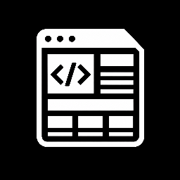
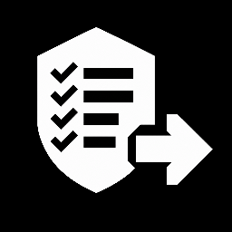

# Skills

*Each skill is ranked from most to least powerful inside its category.*

## Quality of Life

| Skill | Summary | Install | Codex Specific |
| --- | --- | --- | --- |
| 
<strong>Plan My Grill</strong> 
 | !! WARNING: This is a good skill !! Interrogate plans and designs until they are handoff-ready. | `npx skills@latest add CratesSo/skills/plan-my-grill` | 
yes
 |
| 
<strong>Goal</strong> 
 | Design durable Codex self-goals with explicit success and stop conditions. | `npx skills@latest add CratesSo/skills/goal` | 
yes
 |
| 
<strong>Handoff</strong> 
 | Generate concise continuation prompts from current thread context and tool results. | `npx skills@latest add CratesSo/skills/handoff` | 
yes
 |
| 
<strong>HTML Report</strong> 
 | Generate complete standalone HTML reports from recap or custom requests. | `npx skills@latest add CratesSo/skills/html-report` | 
no
 |
| 
<strong>Actions</strong> 
 | Manage workspace actions in `.codex/environments/environment.toml`. | `npx skills@latest add CratesSo/skills/actions` | 
yes
 |
| 
<strong>ADR</strong> 
 | Create architecture decision records for durable repository decisions. | `npx skills@latest add CratesSo/skills/adr` | 
yes
 |

## Code Review

| Skill | Summary | Install | Codex Specific |
| --- | --- | --- | --- |
| 
<strong>Audit Team</strong> 
 | Coordinate agentic audit workflows from scope mapping through triage and fixes. | `npx skills@latest add CratesSo/skills/audit-team` | 
no
 |
| 
<strong>Fix</strong> 
 | Investigate technical failures before applying narrow, verified fixes. | `npx skills@latest add CratesSo/skills/fix` | 
no
 |
| 
<strong>Code</strong> 
 | Apply strict engineering constraints for complex coding, risky edits, refactoring, and cleanup. | `npx skills@latest add CratesSo/skills/code` | 
no
 |
| 
<strong>Preflight</strong> 
 | Run production-readiness preflight checks across security, database, deployment, code, and Bandit scanning for Python. | `npx skills@latest add CratesSo/skills/preflight` | 
no
 |

## Versions

| Skill | Directory | Current version | Tag |
| --- | --- | --- | --- |
| **plan-my-grill** | `plan-my-grill/` | v1.6.3 | `plan-my-grill/v1.6.3` |
| **goal** | `goal/` | v2.0.0 | `goal/v2.0.0` |
| **handoff** | `handoff/` | v3.0.0 | `handoff/v3.0.0` |
| **html-report** | `html-report/` | v1.1.1 | `html-report/v1.1.1` |
| **actions** | `actions/` | v1.0.7 | `actions/v1.0.7` |
| **adr** | `adr/` | v0.1.0 | `adr/v0.1.0` |
| **audit-team** | `audit-team/` | v1.5.3 | `audit-team/v1.5.3` |
| **fix** | `fix/` | v2.1.0 | `fix/v2.1.0` |
| **code** | `code/` | v1.0.0 | `code/v1.0.0` |
| **preflight** | `preflight/` | v1.0.4 | `preflight/v1.0.4` |

## Pin

**Use the matching tag when pinning a published version.**

Examples:

- `CratesSo/skills@actions/v1.0.7`
- `CratesSo/skills@plan-my-grill/v1.6.3`
