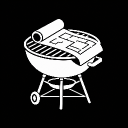

# Skills

*Each skill is ranked from most to least powerful inside its category.*

## Quality of Life

| Skill | Summary | Install | Codex Specific |
| --- | --- | --- | --- |
| 
<strong>Plan My Grill</strong> 
 | !! WARNING: This is a good skill !! Interrogate plans and designs until they are handoff-ready. | `npx skills@latest add CratesSo/skills/plan-my-grill` | 
yes
 |
| 
<strong>Goal</strong> 
 | Design durable Codex self-goals with explicit success and stop conditions. | `npx skills@latest add CratesSo/skills/goal` | 
yes
 |
| 
<strong>Handoff</strong> 
 | Create user-configured continuation tasks from current thread context. | `npx skills@latest add CratesSo/skills/handoff` | 
yes
 |
| 
<strong>Actions</strong> 
 | Manage workspace actions in `.codex/environments/environment.toml`. | `npx skills@latest add CratesSo/skills/actions` | 
yes
 |
| 
<strong>ADR</strong> 
 | Create architecture decision records for durable repository decisions. | `npx skills@latest add CratesSo/skills/adr` | 
yes
 |

## Code Review

| Skill | Summary | Install | Codex Specific |
| --- | --- | --- | --- |
| 
<strong>Code</strong> 
 | Apply strict engineering constraints for complex coding, risky edits, refactoring, and cleanup. | `npx skills@latest add CratesSo/skills/code` | 
no
 |

## Versions

| Skill | Directory | Current version | Tag |
| --- | --- | --- | --- |
| **plan-my-grill** | `plan-my-grill/` | v2.0.0 | `plan-my-grill/v2.0.0` |
| **goal** | `goal/` | v2.0.2 | `goal/v2.0.2` |
| **handoff** | `handoff/` | v3.1.0 | `handoff/v3.1.0` |
| **actions** | `actions/` | v1.0.7 | `actions/v1.0.7` |
| **adr** | `adr/` | v1.1.0 | `adr/v1.1.0` |
| **code** | `code/` | v1.2.0 | `code/v1.2.0` |

## Pin

**Use the matching tag when pinning a published version.**

Examples:

- `CratesSo/skills@actions/v1.0.7`
- `CratesSo/skills@plan-my-grill/v1.6.3`
